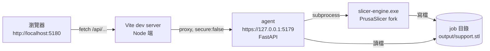
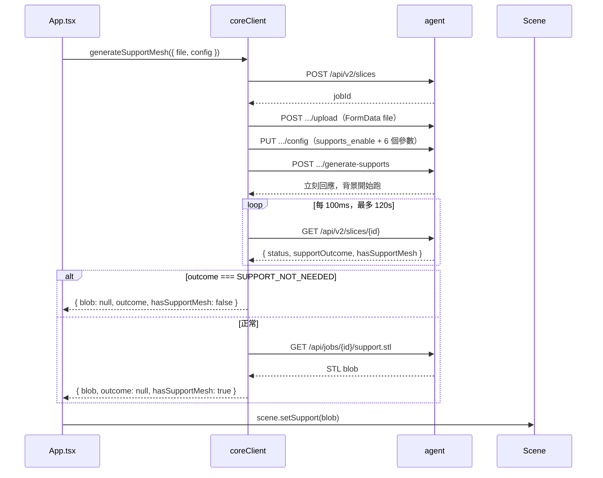

# dev-interface 架構規格

> 這份文件是擴充或修改 dev-interface 的起點。
> 讀完這份就不用再從頭解析 agent API 或 three.js 場景。
>
> 最後更新：2026-09-01。對應 agent 版本：`agent/api_v2.py` 的 v2 API。

---

## 1. 目的與範圍

dev-interface 是 **RD 內部測試工具**。它的唯一目的是讓你看見自己對 slicer core（PrusaSlicer fork）的修改結果。

### 它做什麼

- 在瀏覽器顯示一個可旋轉、縮放、位移的 3D 場景。
- 載入本機 STL 檔案並顯示。
- 呼叫 agent 產生支撐 mesh，把結果用不同顏色疊在模型上。
- 顯示每次產生的耗時與 jobId。
- 提供 support.stl 下載。

### 它不做什麼

以下是**刻意不做**，不是還沒做：

| 不做的事 | 理由 |
|---|---|
| 完整切片、層預覽 | 那是 `web/` 的職責。切片很慢，會拖慢測試迴圈 |
| 部署到雲端 | 只在 local 跑。所有設計都假設 agent 在同一台機器 |
| 使用者管理、專案存檔 | 測試工具不需要狀態 |
| i18n | 單一使用者，繁體中文寫死 |
| 單元測試 | 驗收方式是「用眼睛看 3D 場景」 |
| 響應式版面 | 桌機瀏覽器全螢幕 |

### 與 `web/` 的差別

`web_slicer_core/web/` 也有 React + three.js 前端。兩者不重疊：

| | `web/` | `dev-interface/` |
|---|---|---|
| API | v1 `POST /api/jobs` | v2 `/api/v2/slices/*` |
| 動作 | 完整切片（慢） | 只產支撐（快） |
| 連線方式 | 直連 `https://127.0.0.1:5179` | Vite proxy 轉發 |
| Port | 5174 | 5180 |
| 用途 | 展示切片產品功能 | 驗證 slicer core 修改 |

**不要**把 dev-interface 的改動同步回 `web/`。兩者是獨立的。

---

## 2. 系統邊界



### 為什麼要 Vite proxy

Agent 跑 HTTPS，用自簽憑證（`agent/tls/localhost.crt`）。如果瀏覽器直連，會撞到兩道牆：

1. **憑證警告**。瀏覽器擋掉自簽憑證的 fetch。要手動開一次 `https://127.0.0.1:5179/api/health` 點「繼續前往」。換 profile 就要再點一次。
2. **CORS**。Agent 的允許來源寫死在 `agent/main.py:82-119`，只涵蓋 port 5173–5178 和 3000。

Vite proxy 讓瀏覽器只跟 Vite 同源溝通。轉發發生在 Node 端，Node 不是瀏覽器，不管 CORS；`secure: false` 讓它忽略自簽憑證。

**結果：沒有 CORS、沒有憑證警告、port 可自由選。** 這也是 port 選 5180（在 agent 白名單之外）沒問題的原因。

設定在 [vite.config.ts](vite.config.ts)：

```ts
const AGENT_ORIGIN = 'https://127.0.0.1:5179'
```

Agent 換 port 只需要改這一行。

---

## 3. 檔案結構與職責

```
dev-interface/
├── SPEC.md                本文件
├── README.md              啟動步驟
├── package.json           React 18 + three 0.182 + Vite 5 + TS 5
├── vite.config.ts         port 5180 + /api proxy
├── tsconfig.json          strict、noUnusedLocals
├── index.html
├── test-model/
│   └── 02_slope.stl       固定測試樣本，斜面模型
└── src/
    ├── main.tsx           掛載 React root
    ├── App.tsx            UI 與所有 React state
    ├── App.css            深色主題樣式
    ├── api/
    │   └── coreClient.ts  agent 的唯一對外窗口
    └── viewer/
        ├── Scene.ts       three.js 場景，純類別
        └── Viewer.tsx     Scene 的 React 外殼（很薄）
```

### 分層規則

只有三層，界線很硬：

| 層 | 檔案 | 允許做的事 | 禁止做的事 |
|---|---|---|---|
| API | `api/coreClient.ts` | `fetch` agent、解析回應、丟 `AgentError` | 碰 three.js、碰 React |
| 場景 | `viewer/Scene.ts` | three.js 的一切 | `fetch`、碰 React |
| UI | `App.tsx`、`viewer/Viewer.tsx` | React state、呼叫上面兩層 | 直接 `fetch`、直接 `new THREE.*` |

**為什麼把 three.js 從 React 抽出來**：這個工具是拿來驗證 slicer core 的，不是驗證 React。`Scene.ts` 是普通類別，改渲染行為不會被 re-render、effect 依賴陣列干擾。`Viewer.tsx` 只有 40 行，只負責掛載和 dispose。

---

## 4. 對外契約：agent API

全部路徑都是相對路徑，由 proxy 轉發。實作見 [src/api/coreClient.ts](src/api/coreClient.ts)。

### v2 回應外殼

每個 v2 endpoint 都回這個形狀（`agent/api_v2.py:83`）：

```ts
interface V2Response<T> {
  success: boolean
  message?: string | null
  code?: string
  data?: T | null
}
```

### 使用中的 endpoint

| # | Method | 路徑 | Request | Response `data` |
|---|---|---|---|---|
| — | GET | `/api/health` | — | 健康檢查，只看 HTTP 狀態碼 |
| 1 | POST | `/api/v2/slices` | `{}` | `{ jobId }` |
| 2 | POST | `/api/v2/slices/{id}/upload` | FormData，欄位名 `file`，副檔名必須是 `.stl` | `{ modelId, filename }` |
| 3 | PUT | `/api/v2/slices/{id}/config` | `{ config, isAppend }` | — |
| 4 | POST | `/api/v2/slices/{id}/generate-supports` | — | `{ currentConfig }`，**非同步**，立刻回應 |
| 5 | GET | `/api/v2/slices/{id}` | — | `{ jobId, status, supportOutcome, hasSupportMesh, progress? }` |
| 6 | GET | `/api/jobs/{id}/support.stl` | — | binary STL（注意這是 **v1** 路徑） |

後端來源：`agent/api_v2.py:294`（建立）、`:363`（上傳）、`:319`（設定）、`:528`（產生支撐）、`:1522`（狀態）；`agent/main.py:837`（下載）。

### 未使用但可用的 endpoint

想擴充時看這裡，不用再翻後端：

- `POST /api/v2/slices/{id}/execute` — 完整切片
- `POST /api/v2/slices/{id}/generate-hollow` + `GET /api/jobs/{id}/hollow.stl` — 中空
- `POST /api/v2/slices/{id}/cut` + `GET /api/jobs/{id}/cut_upper.stl` / `cut_lower.stl` — 切割
- `POST /api/v2/slices/{id}/generate-drain-holes` + `GET /api/jobs/{id}/drain_holes.stl` — 排水孔
- `POST /api/v2/slices/{id}/generate-hex-grid` + `GET /api/jobs/{id}/hex_grid.stl` — 蜂巢格
- `POST /api/v2/auto-orient` — 自動擺位
- `GET /api/jobs/{id}/model.stl` — 取回後端存的輸入模型
- `GET /api/jobs/{id}/layers/{idx}.png` — 單層切片圖

---

## 5. 支撐產生流程

實作：`generateSupportMesh()`，[src/api/coreClient.ts](src/api/coreClient.ts)。

流程完全對齊 DS-Online 的 `src/services/supportService.js`。



### 階段回呼

`onStage(stage, detail?)` 讓 UI 顯示目前進度。階段列舉：

```
createJob → upload → config → generate → poll → download → done
```

`poll` 階段的 `detail` 帶後端狀態與百分比（若後端有回 `progress`）。

### 輪詢規則

- 間隔 100ms。支撐產生通常一秒內完成，500ms 會浪費半秒等下一個 tick。
- 逾時 120000ms。
- 後端在 job 失敗時回 **HTTP 200 但 `success: false`**。這是刻意設計，讓輪詢端分得出「還在跑」和「失敗了」。`pollUntilComplete` 檢查 `payload.success`，不是只看 HTTP 狀態碼。

---

## 6. 資料模型

### SupportConfig

六個參數，snake_case，對應 `agent/models.py:48-54` 的 `SLAConfig`。

| 欄位 | 預設 | 意義 |
|---|---|---|
| `support_head_front_diameter` | 0.4 | 支撐頭碰到模型那一端的直徑（mm） |
| `support_head_penetration` | 0.2 | 支撐頭埋進模型表面的深度（mm） |
| `support_pillar_diameter` | 1.0 | 支撐主幹粗細（mm） |
| `support_points_density_relative` | 100 | 支撐點密度，100 為基準值（%） |
| `support_object_elevation` | 5.0 | 模型離平台的距離（mm） |
| `support_critical_angle` | 45.0 | 超過這個傾角才需要支撐（度） |

`supports_enable: true` 由 `generateSupportMesh` 自動加上，不放在 `SupportConfig` 裡。

### SupportResult

```ts
interface SupportResult {
  blob: Blob | null   // SUPPORT_NOT_NEEDED 時為 null
  outcome: string | null
  hasSupportMesh: boolean
  jobId: string
  elapsedMs: number   // 整段流程耗時，用 performance.now() 量
}
```

### AgentError

所有後端失敗都包成 `AgentError`，帶 `code`。已知 code：

`BAD_RESPONSE`、`HTTP_<狀態碼>`、`CREATE_JOB_FAILED`、`UPLOAD_FAILED`、`CONFIG_FAILED`、`GENERATE_FAILED`、`JOB_FAILED`、`JOB_TIMEOUT`、`DOWNLOAD_FAILED`，以及後端自己回的 code（例如 `JOB_ALREADY_EXECUTED`）。

---

## 7. 3D 場景約定

實作：[src/viewer/Scene.ts](src/viewer/Scene.ts)。

### 座標系：Z-up

PrusaSlicer 用 Z-up。STL **直接讀，不做任何軸轉換**。

三個地方要一致：

1. `camera.up.set(0, 0, 1)` — 必須在 `new OrbitControls()` **之前**執行，否則旋轉軸會歪。
2. `gridHelper.rotation.x = Math.PI / 2` — `GridHelper` 預設躺在 XZ 平面，轉 90 度才會躺在 XY。
3. 相機位置用 `(+x, −y, +z)`，等於從右前上方看。

### 原點契約

模型與支撐**共用同一個世界原點**。兩者都**不做 center**。直接 `scene.add()` 就會對齊。

這是後端的保證：`support.stl` 和上傳的 `model.stl` 在同一個座標系。DS-Online 的 `backendService.js:138-140` 稱之為 Contract A。

**如果你發現支撐和模型錯位，那是後端的 bug，不要在前端補位移。**

### 顏色

| 物件 | 色碼 | 材質 |
|---|---|---|
| 模型 | `0x4A90D9`（藍） | `MeshPhongMaterial`，不透明 |
| 支撐 | `0xE94560`（橘紅） | `MeshPhongMaterial`，`opacity: 0.9` |
| 背景 | `0x1A1A2E` | — |

支撐半透明，看得到穿進模型的部分。

### Scene 公開方法

| 方法 | 說明 |
|---|---|
| `setModel(blob)` | 載入模型，取代前一個，自動 `frameAll()` |
| `setSupport(blob \| null)` | 載入支撐；傳 `null` 清掉 |
| `clearAll()` | 清掉模型與支撐 |
| `frameAll()` | 相機對焦到所有 mesh 的整體範圍 |
| `setModelVisible(bool)` / `setSupportVisible(bool)` | 顯示切換 |
| `setModelWireframe(bool)` | 模型線框，看支撐穿透深度用 |
| `setGridVisible(bool)` | 格線與座標軸 |
| `dispose()` | 停動畫、釋放 geometry/material/renderer、移除 canvas |

### 資源釋放

每次換 mesh 都呼叫 `disposeMesh()`，釋放 geometry 和 material。three.js 不會自動回收 GPU 資源。反覆按「重新產生」上百次而不釋放，顯示卡記憶體會被吃光。

視窗大小變化用 `ResizeObserver`，不是 `window.onresize`。這樣側欄寬度變化也能正確反應。

### 沒有用 StrictMode

`main.tsx` 刻意不包 `React.StrictMode`。StrictMode 在開發模式會把 effect 掛載跑兩次，那會建立兩個 WebGL context。對這個工具只有干擾。

---

## 8. React state 清單

全部在 `App.tsx`。沒有 store，沒有 context。

| State | 型別 | 用途 |
|---|---|---|
| `agentUp` | `boolean \| null` | 健康檢查結果，每 5 秒更新。`null` 是尚未檢查 |
| `file` | `File \| null` | 使用者選的 STL。**留在記憶體**，重新產生時不用重選 |
| `config` | `SupportConfig` | 六個參數 |
| `busy` | `boolean` | 流程進行中，鎖住按鈕 |
| `stage` | `string` | 目前階段的中文標籤 |
| `error` | `string \| null` | 錯誤訊息，格式 `[CODE] message` |
| `result` | `SupportResult \| null` | 上次產生結果 |
| `supportUrl` | `string \| null` | 下載用的 object URL，換 blob 時會 revoke 舊的 |
| `showModel` / `showSupport` / `wireframe` / `showGrid` | `boolean` | 顯示開關 |

`sceneRef` 是 `useRef<Scene>`，不是 state。Scene 實例變動不該觸發 re-render。

---

## 9. 踩坑紀錄

這四個坑 DS-Online 都踩過。改動時不要退回去。

### 9.1 每次都建新 job，不重用 jobId

後端的可編輯設定只存在記憶體的 `_pending_jobs`，但 jobId、`support.stl`、`has_support_mesh` 存在磁碟。

重用 jobId 的後果：agent 重啟後，設定 PUT 會被拒（`JOB_ALREADY_EXECUTED`），`generate-supports` 直接短路回傳磁碟上的舊 mesh。**你改的參數會被無聲忽略。**

代價是每次多上傳一次 STL。值得。

來源：`DS-Online/src/services/supportService.js:83-91`。

### 9.2 `SUPPORT_NOT_NEEDED` 是成功，不是錯誤

模型完全自撐（或只有 pad）時，後端回 `status: completed`、`supportOutcome: 'SUPPORT_NOT_NEEDED'`、`hasSupportMesh: false`。

此時磁碟上**沒有** `support.stl`。硬去下載會拿到 404，然後被誤判成產生失敗。

`generateSupportMesh` 在這個分支提早回傳 `blob: null`。UI 顯示黃色提示，不是紅色錯誤。

### 9.3 Agent 是 HTTPS + 自簽憑證

見第 2 節。不要把 `secure: false` 拿掉。

### 9.4 CORS 白名單寫死在後端

`agent/main.py:82-119` 硬編了 port 5173–5178 和 3000。Proxy 方案完全繞過這件事，所以 dev-interface 不需要動後端任何一行。

如果哪天你決定不用 proxy 而改直連，port 就必須落在那份清單內，而且要先手動接受憑證。

---

## 10. 擴充指南

### 10.1 加一個支撐參數

1. 確認 `agent/models.py` 的 `SLAConfig` 有這個欄位。沒有就要先加後端。
2. `src/api/coreClient.ts`：`SupportConfig` 介面加欄位，`DEFAULT_SUPPORT_CONFIG` 加預設值。
3. `src/App.tsx`：`CONFIG_FIELDS` 陣列加一筆（`key`、`label`、`step`、`min`、`max`、`hint`）。

UI 表單是資料驅動的，加陣列元素就會多一列，不用改 JSX。

### 10.2 顯示另一種 mesh（例如 hollow）

1. `coreClient.ts`：照 `generateSupports` + `getSupportStl` 的樣子加 `generateHollow` + `getHollowStl`，路徑見第 4 節。
2. `Scene.ts`：加 `private hollowMesh`、`setHollow(blob | null)`，選一個新顏色。記得在 `clearAll()`、`frameAll()`、`dispose()` 裡也處理它。
3. `App.tsx`：加按鈕、state、顯示開關。

### 10.3 換 agent port 或位址

只改 [vite.config.ts](vite.config.ts) 的 `AGENT_ORIGIN`。程式碼裡全是相對路徑，不用動。

### 10.4 加入完整切片與層預覽

改用 `POST /api/v2/slices/{id}/execute`，輪詢一樣，然後 `GET /api/jobs/{id}/layers/{idx}.png`。

建議在 3D 場景旁另開一個 `<canvas>` 或 ``，不要塞進 `Scene.ts`。`Scene.ts` 只負責 3D。

參考現成實作：`web/src/App.tsx`（那邊走 v1 API，邏輯可借，路徑要換）。

### 10.5 比較兩次產生的結果

`SupportResult` 已經帶 `jobId` 和 `elapsedMs`。把它們推進一個陣列就能做歷史清單。支撐 blob 也留著，就能在 Scene 裡同時載入兩份不同顏色的支撐做疊圖比對。

---

## 11. 執行前提

dev-interface 只是前端。它需要：

1. **Agent 正在跑**：`scripts\run_agent.bat`。腳本會檢查 TLS 憑證存在，找不到會直接退出。
2. **slicer-engine 已建置**：`slicer-engine/bin/slicer-engine.exe` 或 `third_party/prusaslicer_build/src/Release/slicer-engine.exe`。
3. **Python venv**：`run_agent.bat` 會優先用 `.venv312`，沒有就自己建。

路徑解析邏輯見 `agent/config.py:16-30`。

---

## 12. 參考來源

寫這份規格時讀過的檔案。要追細節從這裡開始：

| 檔案 | 看什麼 |
|---|---|
| `agent/api_v2.py` | v2 endpoint 的完整行為 |
| `agent/main.py:82-119` | CORS 白名單 |
| `agent/main.py:837` | `support.stl` 下載的前置檢查 |
| `agent/models.py:27-54` | `SLAConfig` 與支撐欄位 |
| `agent/config.py` | HOST/PORT/TLS/engine 路徑解析 |
| `scripts/run_agent.bat` | agent 啟動方式（HTTPS + 憑證） |
| `DS-Online/src/services/supportService.js` | 支撐流程的原始實作與踩坑註解 |
| `DS-Online/src/axios/backendService.js` | 每個 endpoint 的呼叫方式 |
| `web/src/STLViewer.tsx` | 既有 three.js 場景（v1 版本） |
