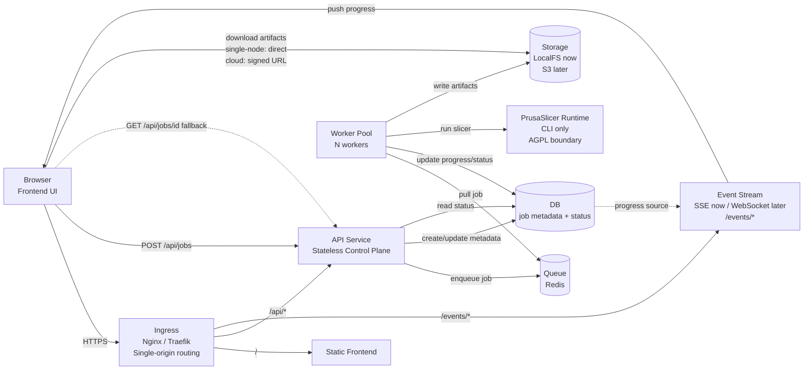
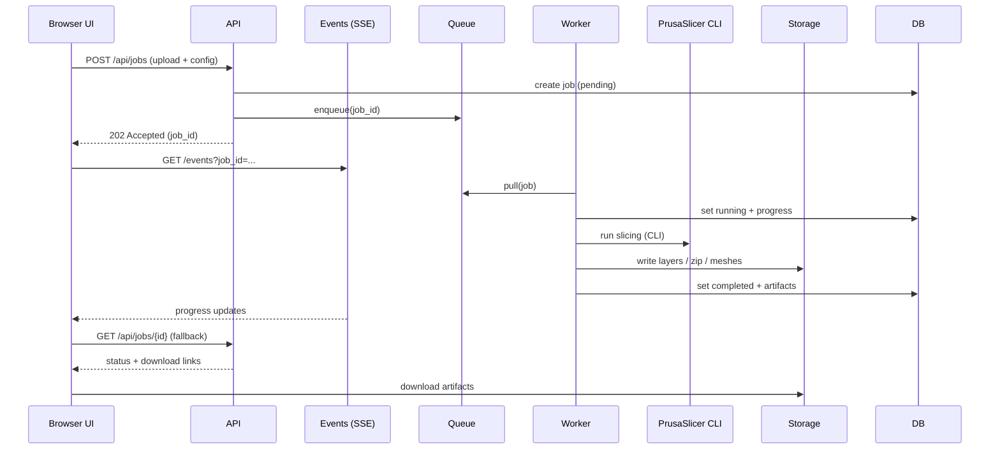

# Single-Node Cloud Experiment

## Overview

This experiment treats a single Mac Studio as a cloud-like deployment node. The architecture mirrors what would run on AWS/GCP, so that future cloud migration requires only deployment config changes — no code refactoring.

- **Single origin**: one domain serves frontend, API, and events — no CORS
- **Stateless API**: handles job creation and metadata only, never runs slicing
- **Queue-worker model**: slicing jobs are enqueued, workers pull and execute independently
- **SSE for progress**: Server-Sent Events push job status to the browser in real time
- **AGPL boundary**: PrusaSlicer is invoked as a CLI subprocess only — no linking
- **Storage abstraction**: local filesystem now, S3 later — same interface
- **Process isolation**: each component is a separate process, restartable independently
- **Horizontal scaling ready**: add workers by spawning more processes (or containers)
- **Docker optional**: bare-metal processes for simplicity now, Compose for migration rehearsal
- **One machine, cloud shape**: ingress + API + queue + workers + storage, all on localhost

## System Overview

## Job Lifecycle

## Components

| Component | Role | Details |
|-----------|------|---------|
| **Ingress** | Single-origin routing | Nginx/Traefik routes `/` → frontend, `/api/*` → API, `/events/*` → SSE. One domain, no CORS. |
| **API** | Stateless control plane | Validates input, stores STL, enqueues job, returns `202`. Never runs slicing. |
| **Queue** | Backpressure | Decouples API from workers. Jobs wait when all workers are busy. Redis or SQLite. |
| **Worker** | Data plane | Pulls jobs, invokes PrusaSlicer CLI, writes artifacts, updates status. Disposable — crash and restart without data loss. |
| **PrusaSlicer** | AGPL runtime | CLI only via `subprocess.run()`. No linking, no shared memory. See [agpl-boundary.md](./agpl-boundary.md). |
| **Storage** | Artifacts | `./jobs/{id}/input/`, `./jobs/{id}/output/`. LocalFS now, swap to S3 with config change only. |
| **Events** | Real-time progress | SSE pushes `{ status, progress }` to browser. Lower latency and load than polling. Auto-reconnect via `EventSource` API. |

## Related Documents

| Document | Description |
|----------|-------------|
| [architecture.md](./architecture.md) | Detailed architecture with migration path |
| [deployment-mac-studio.md](./deployment-mac-studio.md) | Mac Studio process layout, Nginx config, Docker Compose |
| [operations.md](./operations.md) | Job lifecycle, failure handling, restart behavior |
| [security-notes.md](./security-notes.md) | Auth, rate limits, what's intentionally skipped |
| [agpl-boundary.md](./agpl-boundary.md) | PrusaSlicer license boundary analysis |
| [ADR 0001](../../adr/0001-single-node-cloud.md) | Why single-node cloud |
| [ADR 0002](../../adr/0002-single-origin-ingress.md) | Why single-origin ingress |
| [ADR 0003](../../adr/0003-sse-over-polling.md) | Why SSE over polling |
| [ADR 0004](../../adr/0004-queue-worker-model.md) | Why queue-worker model |
