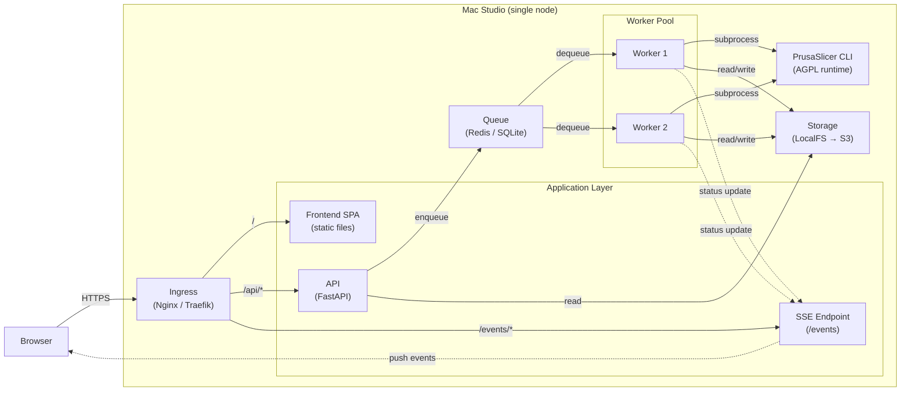
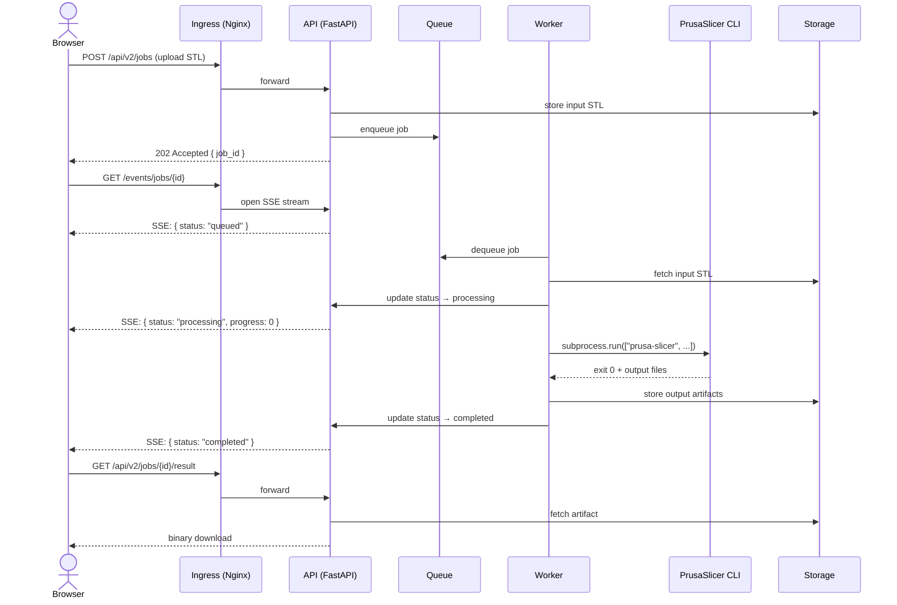

# Single-Node Cloud Experiment

## Overview

This experiment treats a single Mac Studio as a cloud-like deployment node. The architecture mirrors what would run on AWS/GCP, so that future cloud migration requires only deployment config changes — no code refactoring.

- **Single origin**: one domain serves frontend, API, and events — no CORS
- **Stateless API**: handles job creation and metadata only, never runs slicing
- **Queue-worker model**: slicing jobs are enqueued, workers pull and execute independently
- **SSE for progress**: Server-Sent Events push job status to the browser in real time
- **AGPL boundary**: PrusaSlicer is invoked as a CLI subprocess only — no linking
- **Storage abstraction**: local filesystem now, S3 later — same interface
- **Process isolation**: each component is a separate process, restartable independently
- **Horizontal scaling ready**: add workers by spawning more processes (or containers)
- **Docker optional**: bare-metal processes for simplicity now, Compose for migration rehearsal
- **One machine, cloud shape**: ingress + API + queue + workers + storage, all on localhost

## Architecture Diagram



## Job Lifecycle (Sequence)



## Component Explanation

### Ingress (Nginx / Traefik)

The reverse proxy is the only externally-facing process. It routes all traffic by path:

| Path | Destination | Purpose |
|------|------------|---------|
| `/` | Static files | Frontend SPA (HTML/JS/CSS) |
| `/api/*` | FastAPI | REST API for job management |
| `/events/*` | FastAPI | SSE stream for real-time progress |

Single-origin means the browser sees everything as same-domain. No CORS headers, no preflight requests, no cross-origin complexity.

### API (Control Plane)

The API is **stateless** and **fast**. It handles:

- **Job creation**: validate input, store STL, enqueue
- **Job metadata**: status, progress, timestamps
- **Artifact retrieval**: serve output files from storage
- **SSE streaming**: push job status changes to connected clients

The API **never** runs slicing. It accepts a request, puts a message on the queue, and returns immediately. This keeps response times low regardless of how many jobs are processing.

### Queue (Backpressure)

The queue decouples the API from workers. When a job is submitted:

1. API writes to the queue and returns `202 Accepted`
2. Workers pull jobs when they have capacity
3. If all workers are busy, jobs wait in the queue

This provides natural **backpressure**: the system accepts work at the rate it can process it. If the queue depth exceeds a threshold, the API can return `503 Service Unavailable` to signal overload.

Implementation: Redis for low-latency, or SQLite for durability without extra dependencies.

### Worker (Data Plane)

Workers are the **data plane** — they do the actual work. Each worker:

1. Pulls a job from the queue
2. Reads input from storage
3. Invokes PrusaSlicer CLI
4. Writes output to storage
5. Updates job status

Workers are **disposable**: kill one, start another, no state is lost. The job either completes or gets requeued. On a Mac Studio, 2-4 worker processes is typical. In the cloud, workers become container tasks that auto-scale.

### Runtime Boundary (PrusaSlicer CLI)

PrusaSlicer is AGPL-licensed. To maintain a clean license boundary:

- Invoked **only** via `subprocess.run()` — never imported, linked, or embedded
- Communicates through **command-line arguments and files** — no shared memory
- Runs as a **separate process** with its own address space
- Our code is **not a derived work** — same as calling `ffmpeg` or `gcc`

See [agpl-boundary.md](./agpl-boundary.md) for the full analysis.

### Storage (LocalFS now, S3 later)

Storage holds job inputs and outputs:

```
./jobs/{job_id}/
├── input/model.stl
├── output/model.sl1
└── meta.json
```

The storage interface is abstract. Currently it reads/writes to the local filesystem. When migrating to cloud, swap the implementation to S3/GCS — same paths, same API, different backend. No application code changes.

### Events (SSE over Polling)

Job progress is pushed to the browser via **Server-Sent Events**:

- Client opens `GET /events/jobs/{id}` — long-lived HTTP connection
- Server pushes `{ status, progress, message }` as state changes
- Browser `EventSource` API handles reconnection automatically

Why SSE over polling:
- **Lower latency**: updates arrive instantly, not on a timer
- **Lower load**: no repeated requests from the client
- **Simpler than WebSocket**: HTTP-based, works through all proxies, no upgrade handshake
- **Unidirectional**: server→client matches our use case (job progress is read-only)

## Related Documents

| Document | Description |
|----------|-------------|
| [architecture.md](./architecture.md) | Detailed architecture with migration path |
| [deployment-mac-studio.md](./deployment-mac-studio.md) | Mac Studio process layout, Nginx config, Docker Compose |
| [operations.md](./operations.md) | Job lifecycle, failure handling, restart behavior |
| [security-notes.md](./security-notes.md) | Auth, rate limits, what's intentionally skipped |
| [agpl-boundary.md](./agpl-boundary.md) | PrusaSlicer license boundary analysis |
| [ADR 0001](../../adr/0001-single-node-cloud.md) | Why single-node cloud |
| [ADR 0002](../../adr/0002-single-origin-ingress.md) | Why single-origin ingress |
| [ADR 0003](../../adr/0003-sse-over-polling.md) | Why SSE over polling |
| [ADR 0004](../../adr/0004-queue-worker-model.md) | Why queue-worker model |
