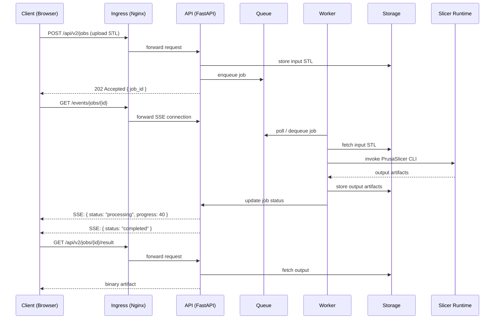
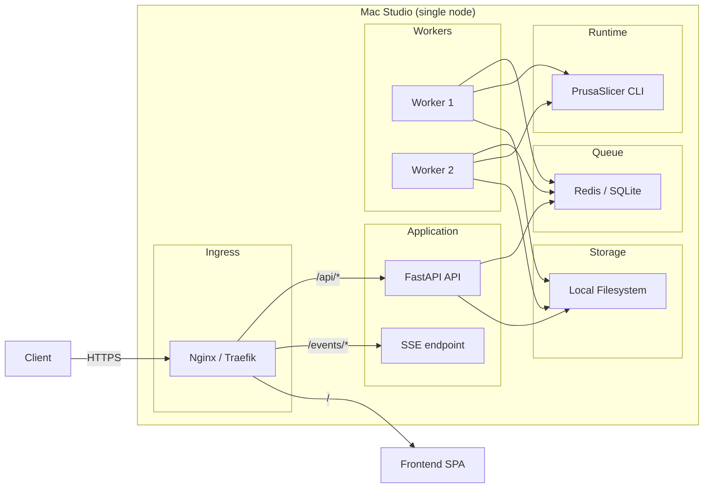

# Single-Node Cloud Architecture

## What is "Single-Node Cloud"?

A single-node cloud is an architecture where one physical machine (Mac Studio) runs all components of a cloud-native system. The key constraint is: **the architecture must be identical to what would run on real cloud infrastructure**, with only the deployment target differing.

This means:

- Components communicate through well-defined interfaces, not shared memory
- Storage is accessed through an abstraction layer, not direct filesystem calls
- Workers are separate processes, not function calls within the API
- Ingress is handled by a reverse proxy, not by the application itself

The goal is zero architectural refactoring when migrating to cloud. Only deployment configuration changes.

## Component Breakdown

| Component | Role | Single-Node Implementation | Cloud Equivalent |
|-----------|------|---------------------------|-----------------|
| **Ingress** | Route traffic, TLS termination | Nginx or Traefik on localhost | AWS ALB / Cloudflare |
| **API** | Job CRUD, validation, metadata | FastAPI process | ECS / Cloud Run |
| **Queue** | Job dispatch, ordering | Redis / SQLite queue | SQS / Cloud Tasks |
| **Worker** | Execute slicing jobs | Separate process(es) | ECS tasks / Lambda |
| **Slicer Runtime** | PrusaSlicer CLI binary | Local binary at known path | Container with binary |
| **Storage** | Job artifacts (STL, gcode) | Local filesystem (`./jobs/`) | S3 / GCS |

## Data Flow

### Slicing Job Lifecycle

### Component Topology (Single Node)

## Why This Architecture

### Problem

The current system has the API process directly executing slicing operations. This creates:

- **Blocking**: long-running slicing blocks API requests
- **Coupling**: API code is intertwined with slicer invocation
- **No horizontal scaling**: cannot add more slicing capacity without duplicating everything
- **Hard migration**: moving to cloud would require rewriting the application

### Solution

Separate concerns into discrete components with clear boundaries:

1. **API is stateless and fast** - accepts jobs, returns metadata, streams events
2. **Workers are disposable** - crash one, start another, no state lost
3. **Queue decouples** - API and workers don't know about each other
4. **Storage is abstract** - swap LocalFS for S3 with one config change

### Trade-offs

| Benefit | Cost |
|---------|------|
| Cloud-ready architecture | More processes to manage on one machine |
| Worker isolation | Inter-process communication overhead |
| Independent scaling | Queue infrastructure dependency |
| Clean AGPL boundary | Slightly more complex deployment |

## Cloud Migration Path

When moving from single node to cloud:

| Change | What to do |
|--------|-----------|
| Ingress | Replace Nginx with cloud load balancer |
| API | Deploy as container (ECS / Cloud Run) |
| Queue | Replace local queue with SQS / Cloud Tasks |
| Workers | Deploy as container tasks, auto-scale |
| Storage | Switch storage backend from LocalFS to S3 |
| Slicer | Bundle in worker container image |

No application code changes required. Only configuration and deployment descriptors.
