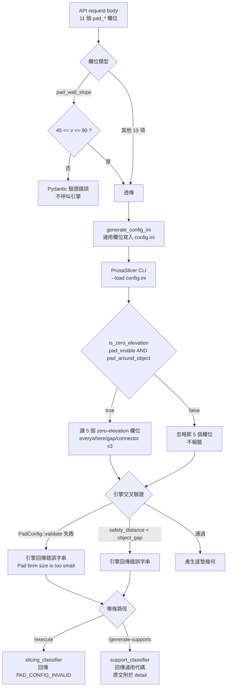

## Context

《SLA 支撐參數全表》與《手動支撐操作全表》盤點後排出的 Backlog，F1（支撐樹全域
參數）已於 `add-support-tree-global-params` 完工。F2 是「底墊全域參數」，共 11 項，
全部是 B2（引擎會讀、後端 `SLAConfig` 未宣告）。

追查引擎原始碼確認了實際資料流，與 F1 相同的部分：

- `agent/sla_operations.py` 的 `generate_config_ini` 是**通用寫入**——逐一走過
  `SLAConfig.model_dump()` 的欄位，`欄位名 = 值` 直接寫進 ini。只要 Python 欄位名
  跟引擎 `PrintConfig.cpp` 註冊的 option key 完全一致，加欄位即可生效。
- `api_v2.py` 的兩條轉換路徑（`_convert_v2_config_to_sla`、`_build_sla_config`）
  對 `SLAConfig` 的新欄位都是動態接住（無白名單限制），F1 已驗證過，本次沿用。
- PrusaSlicer 的 config 載入語意是「只覆寫有送的鍵，其餘用引擎內建預設」。

與 F1 **不同**的部分，是本次必須額外處理的三件事：

1. **`pad_wall_slope` 參與除法運算**。`SLAPrint.cpp:148` 把度數乘 `PI/180` 轉成
   弧度，`Pad.hpp:75` 的 `bottom_offset()` 以 `tan(wall_slope)` 為除數。F1 那 13 個
   欄位沒有任何一個有這種算式風險。
2. **引擎有兩處交叉驗證會被這批參數觸發**。`Pad.cpp:528` 的 `PadConfig::validate()`
   檢查 brim 尺寸與斜度／厚度的組合；`SLAPrint.cpp:748-755` 檢查
   `support_base_safety_distance` 與 `pad_object_gap` 的大小關係。這兩處在 F2 之前
   不可能被使用者觸發，因為相關欄位全部鎖死用引擎預設值。
3. **引擎有兩套不一致的預設值來源**。`PrintConfig.cpp` 的 option 註冊與 `Pad.hpp`
   的 `PadConfig` struct 各有一套預設，3 個欄位對不上。

## Goals / Non-Goals

**Goals:**

- 後端 `SLAConfig` 補齊 11 個底墊全域參數欄位，並開放對應 API request body。
- `pad_wall_slope` 在 API 層做範圍驗證，擋掉會造成引擎除以零的輸入。
- 預設值與引擎 `PrintConfig.cpp` 的註冊值一致，不受 `Pad.hpp` struct 預設誤導。
- 5 個 zero-elevation 專屬欄位的生效條件在契約文件講清楚，供前端之後判斷 UI 顯示條件。
- 引擎既有的兩處交叉驗證規則寫進契約文件，讓前端與 API 使用者知道哪些組合會被拒絕。

**Non-Goals:**

- 不做前端 UI 控件與四語系文案（`supportDefaults.js` / `SupportEditor.vue` / i18n）。
- 不動前端 `sceneCoordinator.js:3888` 的 `PAD_WALL_THICKNESS_MM=2` 硬編碼常數。
  該常數決定手動支撐編輯器裡模型被抬多高，替換成真值屬於前端範圍。
- 不修改 C++ 引擎（`prusaslicer_fork`）。本次全部參數都是引擎已註冊、已在讀的
  既有 option。
- 不在 API 層複製引擎的交叉驗證邏輯（見 D5）。
- 不修引擎 `ProcessActions.cpp` 的 15 個 `return 1`（validate 失敗時 exit code
  為 0 的根因）。該問題已被兩個分類器各自繞過，本次沿用既有繞道，不動 C++。
- 不修 `generate_hollow`／`cut_with_plane` 的罐頭錯誤訊息，也不處置死碼
  `slice_model`。三者與底墊參數無關，屬既有技術債（見 tasks 第 8 節）。
- 不動 F2 以外的 Backlog 項目（F3 逐根覆寫解鎖驗證、F4 側欄管理 UI 等）。

## Decisions

### D1：10 個標準欄位一律走 F1 的既有模式，不特殊處理

11 項扣掉 `pad_wall_slope`（見 D2）之後，其餘 10 項沒有任何需要 API 層介入的
行為，加欄位即完整生效：`pad_wall_thickness`、`pad_wall_height`、`pad_brim_size`、
`pad_max_merge_distance`、`pad_around_object`、`pad_around_object_everywhere`、
`pad_object_gap`、`pad_object_connector_stride`、`pad_object_connector_width`、
`pad_object_connector_penetration`。其中後 5 項另有引擎端的生效條件，見 D4。

本次範圍只做後端 `models.py` ＋ `api/slicing_core.md` 契約文件，前端留給之後
另開 change，與 F1 的範圍切法一致。

### D2：`pad_wall_slope` 加範圍驗證，這是與 F1 不同的先例

引擎資料流：`SLAPrint.cpp:148` 執行 `pcfg.wall_slope = c.pad_wall_slope.getFloat() * PI / 180.0`，
`Pad.hpp:75` 的 `bottom_offset()` 回傳 `(wall_thickness_mm + wall_height_mm) / std::tan(wall_slope)`。
送 `0` 度，`tan(0) = 0`，直接除以零，結果是 `inf` 或 `NaN` 流進幾何運算。
`PrintConfig.cpp:4779-4780` 註冊的 `min = 45` / `max = 90` 只在 GUI 滑桿生效，
`--load config.ini` 這條路徑不強制檢查。

決定：加 `field_validator` 限制合法值為 `45 <= v <= 90`，非法值回傳明確驗證錯誤。

**與 F1 的差異說明**：F1 的 D1 明確決定 `support_max_pillar_link_distance`
**不可**加下限保護，因為 `0` 是引擎定義的合法語意（「完全不串接」）。
`pad_wall_slope` 不同——`0` 不是一個語意，是一個會炸公式的值。兩者不衝突：
判準是「這個值在引擎裡有沒有定義好的語意」，不是「要不要一律透傳」。

**替代方案考量**：曾考慮比照 F1 全部不擋，靠引擎自己的 `PadConfig::validate()`
攔下。放棄理由：`validate()` 檢查的是 brim 尺寸與 `bottom_offset()` 的比較關係，
當 `bottom_offset()` 已經是 `inf`／`NaN` 時，比較運算的結果不可靠（`NaN` 的任何
比較都回傳 `false`），無法保證會被攔下。API 層擋掉是唯一確定有效的位置。

#### D2 白話說明（完工 Artifact SHALL 收錄）

這 11 個底墊參數裡，只有「側壁斜度」這一個要在 API 擋範圍，其他 10 個都照收。
原因是這個參數會被拿去做除法。

引擎算底墊底部要往外擴多少，用的公式是
「（厚度＋空腔深度）÷ tan(斜度)」（`Pad.hpp:75`）。斜度送 0 度，`tan(0)` 就是 0，
變成除以零。算出來不是一個數字，是 `inf` 或 `NaN`（電腦表示「無限大」和
「這不是數字」的方式）。這個壞掉的值會一路流進幾何運算，做出來的底墊會壞掉。

引擎自己其實有登記合法範圍是 45 到 90 度（`PrintConfig.cpp:4779-4780`），
但那個範圍**只在引擎自己的圖形介面拉滑桿時生效**。我們是用寫設定檔的方式
餵給引擎，走這條路不會檢查範圍，送什麼進去就吃什麼。

那能不能靠引擎後面的組合檢查擋下來？不行。那道檢查是拿
「底部外擴量」去跟「brim 尺寸」比大小，但當底部外擴量已經是 `NaN` 的時候，
`NaN` 跟任何數字比大小都會回答「否」，所以檢查會直接放行。**擋不住。**

所以決定在 API 層加驗證，只接受 45 到 90。

這裡要注意一個容易搞混的地方：F1 的時候，我們**刻意不擋**
`support_max_pillar_link_distance` 的 `0`。兩件事看起來矛盾，其實判準一致——
**看這個值在引擎裡有沒有定義好的意思**。`0` 對那個參數是有意思的
（代表「柱子完全不互相串接」），是使用者可能真的要的設定。`0` 對斜度沒有意思，
它只是會炸公式。所以擋的是「會炸的值」，不是「邊界值」。這個判準要寫進
程式碼註解，避免後人以為「這個專案的欄位都該加範圍驗證」。

### D3：預設值採 `PrintConfig.cpp`，不採 `Pad.hpp` 的 struct 預設

兩套預設值來源不一致，實測比對如下：

| 欄位 | `PrintConfig.cpp` 註冊值 | `Pad.hpp` struct 預設 | 採用 |
|---|---|---|---|
| `pad_wall_thickness` | `2.0` | `1.0` | `2.0` |
| `pad_wall_height` | `0.0` | `1.0` | `0.0` |
| `pad_wall_slope` | `90.0`（度） | `atan(1.0)`＝45°（弧度） | `90.0` |
| `pad_brim_size` | `1.6` | `1.6` | 一致 |
| `pad_max_merge_distance` | `50.0` | `50` | 一致 |
| `pad_object_gap` | `1.0` | `1.0` | 一致 |
| `pad_object_connector_stride` | `10.0` | `10.0` | 一致 |
| `pad_object_connector_width` | `0.5` | `0.5` | 一致 |
| `pad_object_connector_penetration` | `0.3` | `0.1` | `0.3` |

決定：一律採 `PrintConfig.cpp`。理由：本後端走的是 `--load config.ini` 這條路徑，
引擎讀 ini 時套用的是 `PrintConfig.cpp` 註冊的預設值；`Pad.hpp` 的 struct 預設只在
C++ 內部直接建構 `PadConfig` 物件（不經 config）時才生效，本路徑走不到
（`SLAPrint.cpp:143-158` 的 `make_pad_cfg()` 會把 struct 的每個欄位逐一覆寫掉）。

**這個決定為什麼是高風險項，而不只是「抄對數字」**：
`generate_config_ini`（`sla_operations.py:294`）的寫法是逐一走過 `SLAConfig.model_dump()`
的**每一個欄位**，不論使用者有沒有在 request body 提供該欄位，一律寫進 ini。
因此本次加欄位的動作，實際效果是「Python 的預設值**取代**引擎的預設值」，
不是「與引擎預設值一致」。填錯的後果不是驗證錯誤，而是所有未特別調整的
使用者，底墊幾何靜默改變且不會收到任何提示。

**防護方式**：除了欄位旁加註解，SHALL 加一條合約測試（tasks 1.4）——直接讀
`PrintConfig.cpp` 原始碼，解析 11 個 `pad_*` 的 `set_default_value(...)`，
與 `SLAConfig` 的預設值逐一比對，不一致即測試失敗。本專案已有此模式的先例：
`agent/tests/test_support_string_contract.py` 即以同樣方式，把分類器的比對字串
釘死在 fork 的 C++ 原始碼上。註解只保護這一次，合約測試保護之後每一次。

#### D3 白話說明（完工 Artifact SHALL 收錄）

引擎裡有兩份底墊預設值清單，數字對不上：

| 參數 | `PrintConfig.cpp` | `Pad.hpp` | 差多少 |
|---|---|---|---|
| 底墊厚度 | 2.0mm | 1.0mm | 差一倍 |
| 空腔深度 | 0mm | 1.0mm | 一個關、一個開 |
| 側壁斜度 | 90 度 | 45 度 | 差一半 |
| 連接柱侵入深度 | 0.3mm | 0.1mm | 差三倍 |

`Pad.hpp` 那份長得很像「權威來源」——檔名就叫 Pad，裡面就是一個叫 `PadConfig`
的結構。但它在我們這條路上根本用不到。我們走的是「寫 config.ini 給引擎讀」，
引擎讀 ini 時套用的是 `PrintConfig.cpp` 那份。`Pad.hpp` 那份只有在 C++ 內部
直接建物件、不經過設定檔時才生效。

為什麼這次特別危險——`generate_config_ini` 會把 `SLAConfig` 的每一個欄位都寫進
ini，不管使用者有沒有送。意思是：

- **F2 之前**：ini 裡沒有 `pad_wall_thickness` 這一行，引擎用自己的 2.0mm。
- **F2 之後**：ini 裡一定會有 `pad_wall_thickness = X` 這一行，X 就是我們在
  Python 寫的預設值。

所以我們填的那個數字，不是「跟引擎一樣的預設值」，而是**取代**引擎預設值的新值。
填錯 = 全部使用者的底墊厚度默默改變，而且沒有人會收到通知，因為切片不會報錯，
只是印出來的東西不一樣了。

怎麼修：11 個預設值全部照 `PrintConfig.cpp`；程式碼旁邊寫註解記錄陷阱；
加一個合約測試，讓測試程式直接去讀 `PrintConfig.cpp` 原始碼，把裡面的
`set_default_value` 抓出來，跟 Python 的預設值一個一個比對，對不上就測試失敗。

為什麼這樣修：前兩點只保護「這一次」，真正的保護是合約測試。以後引擎升級改了
預設值，或是有人「照 Pad.hpp 修正」，測試會立刻紅燈，而不是等到客戶回報
「底墊怎麼變薄了」。

### D4：5 個 zero-elevation 專屬欄位照常開放，API 層不做條件驗證

引擎 `SLAPrint.cpp:48-51`：`is_zero_elevation(c)` 回傳
`c.pad_enable.getBool() && c.pad_around_object.getBool()`。
`SLAPrint.cpp:125-141` 的 `builtin_pad_cfg()` 只有在 `is_zero_elevation()` 為 `true`
時，才讀 `pad_around_object_everywhere`、`pad_object_gap`、
`pad_object_connector_width`／`_stride`／`_penetration` 這 5 個值；否則整組留 struct 預設，
且 `embed_object.enabled` 為 `false`，這 5 個值完全不參與幾何。

**注意**：Backlog 原文寫這 5 項「依賴 F2-6（`pad_around_object`）」，實際條件是
`pad_enable` **與** `pad_around_object` **同時**為 `true`。契約文件須寫精確條件。

決定：5 個欄位照常開放，不加任何條件驗證或連動邏輯。理由：條件不成立時引擎
自行忽略，不報錯、不影響輸出，與 F1 對 `branchingsupport_*` 的處理邏輯一致
（「送了也不會壞，只是不生效」）。UI 的顯示條件（是否要在關閉 zero-elevation
時隱藏這 5 個控件）屬於前端判斷，本次只在契約文件寫清楚條件，不鎖死。

補充引擎行為：`Pad.cpp:66` 的 `breakstick_holes()` 在
`stride <= EPSILON || stick_width <= EPSILON || padding <= EPSILON` 時直接 return，
代表 3 個 connector 欄位設 `0` 會靜默不產生連接柱。這是既有行為，不是錯誤，
但契約文件要寫，避免被回報成「設了沒反應」。

#### D4 白話說明（完工 Artifact SHALL 收錄）

有 5 個參數（強制全面環繞、物件間隙、連接柱間距／寬度／侵入深度），只有在
「底墊產生」和「環繞物件底墊」**兩個開關同時打開**時，引擎才會去讀它們。
條件寫在 `SLAPrint.cpp:48-51`，就一行：`pad_enable && pad_around_object`。
兩個開關沒同時開，引擎連看都不看這 5 個值，也不會報錯。

要決定的問題是：開關關著的時候，使用者送這 5 個值進來，API 要不要擋下來說
「你現在設這個沒用」？

決定是不擋。照收，照寫進 ini，讓引擎自己忽略。四個理由：

1. **這不是錯誤**。使用者可能先把參數調好，再打開開關。調整順序是他的自由，
   API 不該規定。
2. **會弄壞存檔讀檔**。一份儲存的參數檔會包含全部欄位。如果 API 在開關關著時
   拒收這些欄位，這份檔案就讀不回來了——存得進去，讀不出來。
3. **引擎處理得很乾淨**。條件不成立就整組不讀，不報錯、不影響輸出。沒有需要
   我們補救的地方。
4. **F1 已經有同樣的先例**。`branching` 那 19 個參數也是「送了不會壞，只是
   不生效」，當時就是這樣處理的。

那使用者怎麼知道自己白調了？這件事要在畫面上講，不是在 API 擋。分工是：
API 負責資料正確，UI 負責告訴人「這個現在有沒有用」。所以契約文件寫精確條件，
前端接手時，在條件不成立的情況下把這 5 個控件變灰或隱藏。

順帶修正一個文件錯誤：Backlog 原文寫這 5 項「依賴 F2-6（`pad_around_object`）」，
只講了一個開關，實際是兩個。這個差別會害到前端——如果只看 `pad_around_object`，
那在「底墊產生」關著的時候，控件還是會亮著，使用者調了照樣沒用。所以契約文件
必須寫兩個開關的完整條件。

### D5：引擎既有的交叉驗證不在 API 層複製，只在契約文件揭露

引擎有兩處交叉驗證會被本批參數觸發：

1. `Pad.cpp:528` 的 `PadConfig::validate()`：當
   `brim_size_mm < 0.1`，或 `bottom_offset() > brim_size_mm + wing_distance()`，
   或 `get_waffle_offset() <= 0.1` 時，回傳
   `"Pad brim size is too small for the current configuration."`。
   這是一條跨 `pad_brim_size`／`pad_wall_thickness`／`pad_wall_height`／
   `pad_wall_slope` 四個欄位的組合條件。
2. `SLAPrint.cpp:748-755`：zero-elevation 啟用且
   `support_base_safety_distance < pad_object_gap` 時，回傳
   `"'Support base safety distance' has to be greater than the 'Pad object gap' parameter"`。
   這條跨越 F1 的欄位與 F2 的欄位。

決定：不在 Pydantic 層複製這兩條規則，理由有三：

- 條件式牽涉 `tan()`、`wing_distance()` 等引擎內部推導，在 Python 重寫等於複製
  一份會走樣的引擎邏輯，日後引擎改了兩邊就不一致。
- 第 2 條跨 F1／F2 兩批欄位，複製後任何一邊改動都要同步維護。
- 引擎本來就會擋，錯誤訊息本身清楚可讀。

代價是使用者要送出切片才會知道組合不合法，不是在 API 驗證階段就知道。這個
代價可接受，因為兩條規則都寫進 `api/slicing_core.md`，前端可依此在 UI 端先做
提示。

**這個決定成立的前提，是引擎的錯誤真的傳得回來。** 此前提已查核完畢，成立：

- `SLAPrint::validate()` 在 `ProcessActions.cpp:734` 執行，**位置在所有 fast path
  之前**，因此 `/generate-supports`（support-only fast path）與 `/execute`
  兩條路徑都會跑到 `PadConfig::validate()`。
- `/execute` 走 `jobs.py:433` 的 `run_slicing` → `slicing_classifier`，其
  `_VALIDATE_CODE_MAP` 已含 `("Pad brim size is too small", "PAD_CONFIG_INVALID")`
  （2026-08-20 的 `add-slicing-error-codes` change 加入）。回傳具體代碼。
- `/generate-supports` 走 `sla_operations.py:444` 的 `classify_support_result`
  → `support_classifier`，其 `VALIDATE_CODE_MAP` 缺這一條，會落到通用的
  `SUPPORT_GENERATION_FAILED`——但該路徑的 fail-closed 機制會把**原始
  stdout／stderr 全文附在 `detail`**，引擎講的原因不遺失，只是呼叫端分不出
  錯誤種類。

結論：**兩條路徑都拿得到引擎的錯誤原文，D5 的前提成立，本次範圍不需要動任何
錯誤分類邏輯。** `support_classifier` 補對照表屬獨立 change，見 tasks 第 7 節。

## Flowchart

## Risks / Trade-offs

- **[Risk]** `/generate-supports` 遇到底墊參數組合錯誤時，回傳通用的
  `SUPPORT_GENERATION_FAILED`，呼叫端分不出是哪一種失敗（`/execute` 則有
  具體的 `PAD_CONFIG_INVALID`）。
  → **Mitigation**：**接受此限制，本次不處理。** 原始 stderr 全文仍附在
  `detail`，引擎講的原因不遺失，API 使用者讀得到。補對照表屬獨立 change
  的範圍（tasks 第 7 節），不擋本次的 API 開放目標。

- **[Risk]** `pad_wall_slope` 加了 validator，與 F1「一律透傳」的慣例不同，可能
  被後續維護者誤解為「本專案的欄位都該加範圍驗證」。
  → **Mitigation**：`models.py` 該 validator 旁註明判準——「有除法風險或會產生
  `NaN` 的欄位才擋；引擎有定義語意的邊界值（如 `0` = 停用）一律不擋」，並引用
  F1 `support_max_pillar_link_distance` 作為反例。

- **[Risk]** `pad_wall_height` 預設 `0`（關閉空腔），使用者調大之後，引擎 tooltip
  自帶脫模警告（樹脂在空腔內產生吸附效應，離型困難）。本次不做 UI，這個警告
  沒有地方顯示。
  → **Mitigation**：警告文案寫進 `api/slicing_core.md` 的欄位備註，前端接手時
  沿用。

- **Trade-off**：本次選擇不修改引擎、不複製驗證邏輯，維持「不動 C++」的範圍
  邊界，換來的代價是使用者要到切片階段才知道參數組合不合法。這與 F1 對
  `support_base_safety_distance` 的處理一致（後端如實傳遞、文件講清楚陷阱）。

## Migration Plan

- 純新增欄位，皆有預設值，向後相容既有已儲存的 profile／request body。
- 不需要資料遷移或 feature flag；欄位不存在的舊 client 送出的 request 仍會用
  Pydantic 預設值正常運作，且該預設值與引擎原本套用的預設值相同，輸出不變。
- 若上線後發現某欄位造成非預期結果，可只在前端下拉／滑桿移除該控件（保留後端
  欄位），是可獨立回退的最小範圍。

## Open Questions

- ~~全切片路徑（`/execute`）對引擎 `validate()` 失敗的偵測是否可靠~~
  **已查核完畢，結論：可靠，本次不需處理。** `/execute` 走 `jobs.py:433` 的
  `run_slicing` ＋ `agent/slicing_classifier.py` 的七步分類器，exit≠0 與 exit=0
  兩條路徑都涵蓋。原先的疑慮來自誤把 `sla_operations.py:560` 的 `slice_model`
  當成 `/execute` 的實作——該函式無任何生產端呼叫者（只有
  `test_preview_scale_contract.py` 引用），是死碼。
- 支撐生成路徑對底墊參數失敗只回傳通用代碼（原文仍附於 `detail`）。
  **已確認不擋本次的 API 開放目標，列為已知限制**，補對照表屬獨立 change。
- 5 個 zero-elevation 專屬欄位在 UI 的顯示條件（關閉 zero-elevation 時隱藏、
  或顯示但 disabled），留給未來前端 change 決定，本次不鎖死。
- 前端 `PAD_WALL_THICKNESS_MM=2` 硬編碼常數的替換時機，屬於前端 change 範圍。
