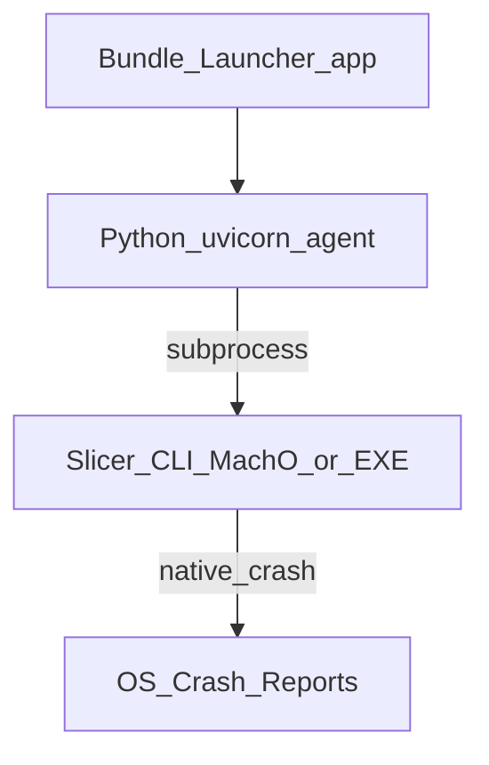

## 用語慣例

本 change（含 `spec.md`、`blacklist.md`、`acceptance-procedure.md`、`implementation-checklist.md`）中的 **MUST／MUST NOT／MAY／SHOULD** 依 [RFC 2119](https://www.rfc-editor.org/rfc/rfc2119) 慣例解讀：MUST／MUST NOT 為絕對要求（無 SHOULD／建議性語句混用於驗收條件）；MAY 為允許但不要求。中文譯註（必須／不得／可以）僅為輔助閱讀，規範效力以 MUST／MUST NOT／MAY 原文為準。

## 背景

### 問題本質

- 切片運算在 **CLI 子行程**；agent／Launcher 存活與 CLI crash 分離（既有隔離）。
- macOS ReportCrash 寫入 `.ips`；Windows 對等為行程名、模組路徑與 WER／崩潰傾印中的符號／映像名。
- 實測（macOS）抬頭指紋：`PrusaSlicer`、`com.prusa3d.slic3r/`；stack：`Slic3r::SLAPrint::process` 等（見 `macOS_system_report.md`）。

### 產品接受線（已定案 2026-07-14；C 策略精簡定案 2026-07-17）

| 層級 | 描述 | 本版 |
|------|------|------|
| L1 抬頭／路徑 | Process、path、映像檔名、Identifier／Version（及 Win 對等）不露 Prusa／slic3r／prusa3d | **必須（含於 L2 交付）** |
| L2 OS crash report 可讀指紋 | `.ips`／WER／傾印中**可讀**函式名、thread name、公開 export 不再命中黑名單（含 `Slic3r::`） | **必須達標**；手段＝**精簡版 C′**（見 D3） |
| L3 靜態反編譯抗性 | 全面 `Slic3r::`→`slice::`、OLLVM／混淆、`strings` 清品牌、packer／encrypt-at-rest | **僅可行性評估，預設本版不產品化** |

**平台：** **macOS 與 Windows 皆為正式驗收必過**（不可只做一側）。

### 威脅模型（明訂對手與範圍，2026-07-17 補）

「達成需求目的」的判定必須綁定明確對手，否則無客觀終點。

| 對手 | 能力 | 本 change 立場 |
|------|------|----------------|
| **目標對手** | 一般使用者／客服／第三方，僅閱讀 OS 當機對話框、`.ips`／WER、行程監看器、安裝路徑 | **必須防護**：這些表面零品牌指紋即達標 |
| 進階觀察者 | 讀取產品輸出檔（gcode／設定）、字串掃描消費者 binary | **部分**：屬 L3，本版不保證 |
| **非目標對手** | 有能力的逆向工程師（反組譯、行為分析、檔案格式比對） | **不防護、不承諾**（見 `proposal.md` 非目標） |

**AGPL 揭露天花板（先天上限）：** 本 change 依 `REQ-DEID-011` **必須**保留 AGPL license、修改聲明與 Corresponding Source offer。因此**任何查看隨包法遵文件或原始碼 offer 的人，本來就會得知底層第三方來源**。L1／L2 僅降低「OS 診斷／執行介面」的品牌指紋，**不等於**「無人可辨識」；此為法律義務造成的目的上限，不得以去識別為由移除或弱化揭露（見 D9）。

## 目標與非目標

**目標：**

- **L1+L2 雙平台達標**：改名重包（A）+ 身分字串去品牌（B）+ **精簡版符號策略（C′）**。
- 同步評估 D／E（加密／packer／攔截 Crash Reporter）與 L3 加深手段可行性；**不得**以 D／E／L3 取代 A+B+C′。
- Agent／Bundle-Launcher 雙平台包版路徑一致去品牌。

**非目標：**

- 前端資安審查、UI 改版、安裝流程簡化、海地交接。
- 破壞 AGPL 邊界（in-process 連結 libslic3r／FFI）。
- 未評估完成即全面上線商業 packer 或關閉系統 Crash Reporter（L3／E）。
- **全面** C++ namespace `Slic3r::`→`slice::` 重命名、OLLVM／控制流混淆、或以「原始碼註解／`strings` 全面去字」作為 L2 驗收。

## 決策

### D1：改名重包為必要基線（非可選）

**決策：** Windows dll／exe 與 macOS CLI／相關產物 **必須**改名並納入 Bundle-Launcher 正式包版；agent 必須解析新路徑／檔名。

**理由：** L1 與雙平台使用者可見路徑／行程名皆依賴產物檔名。

### D2：身分字串去品牌為必要（CLI 不以 reverse-DNS Bundle ID 為阻塞）

**決策：** 正式包 **必須**清除 OS diagnostics 可見之品牌身分字串：macOS `.ips` 的 `bundleInfo`／`codeSigningID`、Version 字串；Windows VERSIONINFO／產品名／內部名等。具體值見 [`naming-manifest.md`](./naming-manifest.md)。

**macOS CLI 實務：** 引擎為 headless Mach-O、非 `.app`。`codeSigningID` **MUST** 設為與執行檔名一致之中性字串；品牌化 `Info.plist`／`CFBundleIdentifier` **MUST** 刪除或改為同名中性值。**不要求**為此 CLI 建立法人 reverse-DNS Bundle ID（`com.<公司>.…`）產品體系。

**理由：** 抬頭級欄位不依賴堆疊；不做則 L1 失敗。CLI helper 的正規實務是「去品牌」，不是「註冊 App Bundle ID」。

### D3：L2 本版必須達標；採精簡版 C′，非全面 namespace／混淆

**決策：** 正式對外產物 **必須**使 OS 崩潰報告中之**可讀**堆疊／thread／公開 export 不再命中黑名單。L2 的必要手段定案為 **精簡版 C′**，**不是**全面改命名空間或 OLLVM：

| C′ 項目 | 必要性 | 說明 |
|---------|--------|------|
| **符號可見性控制（優先）＋ strip** | **必須** | **結果導向**：consumer 產物在簽章前完成 strip／符號剝除，使 ReportCrash／WER **不得**將堆疊解析為含黑名單 token 的函式名。**macOS PoC 定案（2026-07-17，tasks 2.4）：** target-scoped `-fvisibility=hidden -fvisibility-inlines-hidden`（`libslic3r`＋CLI）＋ plain `strip`（**否決 `strip -x` 當 L2 充分條件**）＋ `codesign --identifier slicer-engine`；驗收時 consumer 不得附同 UUID dSYM／未 strip 複本（否則 ReportCrash／CoreSymbolication 仍可還原 `Slic3r::`）。殘餘 ~172 global mangled 名移交 2.2／5.1 收斂，不阻擋「堆疊無 `Slic3r::`」PoC。Windows DLL：僅導出單一中性 entry。**`-exported_symbols_list` 僅適用需控 export 的 dylib／DLL，不得誤套在 macOS CLI exe 上當 L2 充分條件。** `-Wl,-dead_strip` 是 dead-code 消除，不是符號隱藏。 |
| **RTTI／例外型別名稱** | **必須評估並處理** | typeinfo 字串 strip 不清除；未捕捉例外可能洩漏 demangle 型別名。**必須**以拋例外 crash site 實測；必要時 CLI 進入點 top-level catch 轉中性訊息。 |
| **Thread name 去品牌（全部 call site）** | **必須** | 盤點所有 `set_current_thread_name`／`SetThreadDescription`（含 `slic3r_main` **與** TBB／worker 如 `slic3r_tbb_*`），一律中性命名（≤15 chars）。僅改 main **不足**。 |
| **Windows 公開 export 去品牌** | **必須** | `PrusaSlicer.dll`／`slic3r_main` → `slicer_core.dll`／**唯一** `slicer_run_cli`（`.def` 或等效）；shim／CMake／VERSIONINFO／錯誤字串原子遷移。見 [`windows-policy.md`](./windows-policy.md)（tasks **2.3**）。 |
| 全面 `Slic3r::`→`slice::` | **本版不做** | 屬 L3。 |
| OLLVM／控制流混淆／packer | **本版不做** | 屬 L3／D。 |

**現況證據（2026-07-17 實測）：** 正式 macOS 包未 strip；真實 Mach-O 檔名為 `PrusaSlicer`（`prusa-slicer` 僅 symlink）。

**C′ 是最低實作、非預先保證：** 最終是否達標，以最終簽署包依 `acceptance-procedure.md`（token 掃描＋**第三方品牌歸因**正向複核）為準。

**內部除錯：** 見 D10／D13；dSYM／PDB **不得**進 consumer 包。

### D4：維持 CLI subprocess 與 AGPL 邊界

**決策：** 引擎繼續僅經 subprocess 呼叫；不連結 libslic3r。

### D5：雙平台對等驗收（macOS 與 Windows 皆必過）

**決策：**

| 平台 | L1 驗收媒介（例） | L2 驗收媒介（例） |
|------|-------------------|-------------------|
| macOS | DiagnosticReports `.ips` 抬頭欄位 | 同 `.ips` Translated／threads 符號字串 |
| Windows | 行程名、模組完整路徑、WER／事件或傾印摘要中的映像名 | 傾印／WER／除錯器可見之公開符號字串（正式包應無品牌可讀符號） |

任一侧未過即**不得**宣告本能力完成。

### D6：功能性命名表為產品簽核輸入

**決策：** 採功能性／角色型命名（非行銷品牌、不含 `bundle`／`prusa`／`slic3r`）。見 [`naming-manifest.md`](./naming-manifest.md)（**Status=approved**，2026-07-17）。**已確認：** `slicer-engine`／`slicer_core.dll`／`slicer_run_cli`／正式包目錄 `slicer-engine/`（`slicer` ≠ `slic3r`）。衍生對齊：`slicer-worker`／`SLICER_ENGINE_BIN` 等；`slice::` namespace 僅 L3 選配。**不以**法人 reverse-DNS Bundle ID 為阻塞項。

### D7：Debug 閘控與正式包分離；QA＝release-equivalent derivative

**決策：** 崩潰注入 **MUST** 僅以 compile-time flag（如 `BUNDLE_QA_CRASH_HARNESS`）編入 **qa** flavor；consumer release **MUST NOT** 含 runtime env 可啟動之故意崩潰路徑。

**QA flavor 定義（release-equivalent）：** 與 consumer **共用**同一編譯／連結／可見性／strip／簽署流水線，**唯一**允許差異為 compile-time harness。`build_id` 獨立；manifest 以 `qa_delta` 記錄對應 consumer build。動態 crash 驗收以 qa 包為主；consumer 必須另過靜態 L1／L2＋binary inspection。不得單靠 qa 動態結果宣稱 consumer 已通過。詳見 [`artifact-manifest.schema.md`](./artifact-manifest.schema.md) §3。

### D8：加密／packer（D）與 Crash 攔截（E）不取代 A+B+C′

**決策：** D／E 僅評估；若採用必須加在 L1+L2（A+B+C′）之上。E 預設不建議。**不得**以「加密即可不 strip」通過驗收。

## 技術選項矩陣

| ID | 方向 | 對 L1 | 對 L2 | 本版定位 |
|----|------|-------|-------|----------|
| A | 產物／路徑改名重包 | 高 | 低 | **必要** |
| B | 身分字串去品牌（macOS codeSigningID／Info.plist；Win VERSIONINFO） | 高 | 無 | **必要** |
| **C′** | **精簡版 C：strip＋thread 名＋Win export／DLL ABI** | 低 | **高（達 L2）** | **必要** |
| C-full | 全面 `Slic3r::`→`slice::`／OLLVM／符號混淆 | 低 | 冗餘＊ | **L3；本版不做**（＊strip 後 L2 已達） |
| D | Packer／encrypt-at-rest | 低＊ | 低＊ | 僅評估；＊須與 A 併用；**不取代 strip** |
| E | 攔截 Crash Reporter | 視實作 | 視實作 | 僅評估；預設不建議 |

**定案最低組合：** **A + B + C′**（雙平台）；C-full／D／E 僅能作為加成，不能取代最低組合。

### D9：去識別不等於授權匿名

**決策：** 修改／重新命名 fork 的正式包必須保留 AGPL license、copyright、顯著修改聲明與 exact Corresponding Source offer。使用者可在合法揭露位置得知第三方來源；L1／L2 僅限降低 OS diagnostics／產品執行介面中的品牌指紋。

**理由：** Subprocess 邊界只處理衍生作品邊界，不消除修改後 AGPL Program 本身的發布義務。現有 `agpl-boundary.md` 所稱「未修改 binary」已不符合 fork 與 crash harness 現況，必須在實作前修正並交法務／OSS owner 簽核。

### D10：正式 symbols 與內部 diagnostics 分流

**決策：** Consumer Release 不含 dSYM／PDB；每個 engine artifact 必須有 neutral build ID 與 UUID／GUID，內部 symbols 儲存於受 ACL 保護之 artifact store，定義 retention、hash、symbolication 與 rollback runbook。

**Windows headless Release PDB policy（tasks 2.3 定案，2026-07-17；tasks **2.5 PoC PASS**；**5.3／Launcher §4 unsigned 2026-07-19 PASS**）：** 正式建置（含 `SLIC3R_GUI=OFF`）**MUST** 顯式：compiler debug info（`/Zi` 或等效）＋ linker `/DEBUG`＋可控 `/PDB:<staging>/<build_id>/slicer-engine.pdb|slicer_core.pdb`＋ **`/PDBALTPATH:slicer-engine.pdb|slicer_core.pdb`**（PE 內僅中性短檔名）。流程：**先**上傳匹配 PDB 至 symbol store 並寫入 manifest（GUID+Age），**再**交付 consumer PE（bundle **無** `.pdb`；debug directory **無**品牌／`prusaslicer_build` 路徑）。**否決**「GUI=OFF 自然有 PDB」與「只 `/XF *.pdb`」。完整 ABI／export／原子遷移見 [`windows-policy.md`](./windows-policy.md)；PoC 證據見 [`poc/REPORT-WIN.md`](./poc/REPORT-WIN.md)。

**理由：** L2 不得以永久失去事故診斷能力為代價。

**D10a：SBOM 格式定案。** 所有 REQ-DEID-011／012 要求的 build manifest／SBOM **MUST** 採 **SPDX 2.3 JSON（ISO/IEC 5962:2021）**；若工具鏈限制無法產出 SPDX，**MAY** 改用 CycloneDX 1.5 JSON，但同一 artifact 類型（macOS engine／Windows engine／Launcher）**MUST NOT** 混用兩種格式，且選用格式須記錄於 `acceptance-procedure.md` evidence metadata 的 `sbom_format` 欄位。

### D11：驗收對象為最終簽署 artifact，並設 CI release gate

**決策：** 靜態掃描與動態 evidence 必須綁定 post-sign artifact。macOS 為 codesign／notarize／staple 後 app／DMG；Windows 為 Authenticode 後 installer／bundle。Release pipeline 必須依 [`blacklist.md`](./blacklist.md) 與 [`acceptance-procedure.md`](./acceptance-procedure.md) fail closed。

**理由：** strip、patch、install-name 或 rename 若發生在 signing 後會破壞簽章；若只驗 raw build 也無法證明消費者拿到的包合格。

### D12：去識別不得改變切片行為

**決策：** 兩平台均需對全部 engine CLI operation 執行 golden／integration regression，並在 PoC 後簽核 output tolerance 與 performance budget。

**理由：** Windows shim／DLL ABI、CMake target、resource discovery 與符號 visibility 改動都有功能回歸風險。

### D13：產物交接流水線與單一 strip／sign 責任

**決策：** 權威流水線與 owner 如下（細節見 [`artifact-manifest.schema.md`](./artifact-manifest.schema.md)）：

1. **fork（`web_slicer_core`）MUST：** 改名、身分、thread／export、可見性控制 → link unstripped → 產 dSYM／PDB 並封存 → **consumer strip／排除 PDB** → 產出含 `pre_strip_sha256`／`post_strip_sha256` 之 artifact manifest。
2. **Launcher MUST：** 僅複製 **post-strip** consumer 產物 → 驗證 manifest／hash／strip 掃描 → codesign／Authenticode → 記錄 post-sign hash。
3. **Launcher MUST NOT：** 對引擎 binary 再 rename／strip／patch。
4. fork 交付之「L2-ready」僅指**靜態** L1／C′ 就緒；**動態** L1／L2 僅能對最終簽署包（或 release-equivalent qa 包）宣告。

**理由：** 消除「fork 已 L2」與「Launcher 再 strip」之雙重責任；避免簽章後修改與 hash 歧義。

## 風險與權衡

| 風險 | 緩解 |
|------|------|
| Win／mac 符號工具鏈不一致 | 雙平台各寫 L2 checklist；共用黑名單 |
| Strip 後無法除錯 | D10：內部 dSYM／PDB symbol store；正式包不含 |
| 改名漏改單平台腳本 | tasks 強制雙平台包版與掃描 |
| 誤以加密代替 L2／strip | 規格禁止；驗收看 `.ips`／WER 可讀欄位零黑名單，且 consumer binary 已 strip |
| 修改後 fork 重新命名造成 AGPL／歸屬風險 | REQ-DEID-011；Legal／OSS release gate |
| Crash harness 可被終端使用者以 env 啟動 | QA compile-time flavor；consumer binary 不含 harness |
| Strip 後無法處理 production crash | D10 symbol supply chain |
| 驗收 raw binary、正式包卻不同 | D11 僅接受 final signed artifact |
| Windows DLL／shim ABI 被改名破壞 | 原子遷移、export scan、loader smoke test |

## 待產品簽核（剩餘）

1. ~~L1 vs L2~~ → **已定：本版 L2（含 L1）**  
2. ~~是否雙平台~~ → **已定：Win + macOS 皆必過**  
3. ~~C 策略深度~~ → **已定（2026-07-17）：精簡版 C′（strip＋thread＋Win export）；全面 namespace／OLLVM＝L3 不做**  
4. ~~命名表／artifact manifest~~ → **已簽核（2026-07-17）：** [`naming-manifest.md`](./naming-manifest.md)＋[`artifact-manifest.schema.md`](./artifact-manifest.schema.md)（Status=approved）  
5. ~~strip／sign ownership~~ → **已定（D13）：fork strip；Launcher 只驗證＋簽署**  
6. ~~是否允許評估結論否決 E（預設是）~~ → **已定（2026-07-19，tasks 1.5／2.8）：** E／D／C-full 僅 L3；不得取代 A＋B＋C′ — Vance Approve；見 [`evidence/signoff-gate5-pending-20260719.md`](./evidence/signoff-gate5-pending-20260719.md)＋[`evidence/feasibility-A-E-2.1-20260719.md`](./evidence/feasibility-A-E-2.1-20260719.md)  
7. ~~macOS M1 PoC（改名＋strip＋三 crash＋scanner）~~ → **已通過（2026-07-17）：** [`poc/REPORT.md`](./poc/REPORT.md)  
8. ~~已知乾淨參考報告（2.4b）~~ → **已批准（2026-07-17）：** [`clean-reference-report.md`](./clean-reference-report.md)
9. ~~Windows 政策（2.3）~~ → **已定案：** [`windows-policy.md`](./windows-policy.md)  
10. ~~Windows PoC（2.5）＋compile-time harness（2.6 PoC）~~ → **已通過：** [`poc/REPORT-WIN.md`](./poc/REPORT-WIN.md)
11. ~~Gate 5／1.5／2.8／7.7~~ → **已批准（2026-07-19）：Vance**（Security／Release／QA／Legal）

**工程進度：** 見 [`PROGRESS.md`](./PROGRESS.md)。Change status=`in_progress`（**8.5 promote 已關**；可選僅 **8.6** archive → `completed`）。  
**已落地（2026-07-19 夜）：** 雙平台 §7 工程＋Gate 5 人簽（Vance）；mac `…2111`；Win 7.2／7.5／7.6；spec promote。  
**殘留（非 blocking）：** 可選 8.6；mac 4.6／mac QA 4.2；5.1b。  
**下一步：** 可選 **8.6** archive（可暫緩）。

## 規範性附件

- [`blacklist.md`](./blacklist.md)：token、scope、例外與 pass／fail。
- [`acceptance-procedure.md`](./acceptance-procedure.md)：雙平台可重現驗收。
- [`artifact-manifest.schema.md`](./artifact-manifest.schema.md)：fork→Launcher 交接 schema 與流水線。
- [`naming-manifest.md`](./naming-manifest.md)：跨平台命名與佈局。
- [`traceability.md`](./traceability.md)：Requirement → Design → Task → Evidence。
- [`implementation-checklist.md`](./implementation-checklist.md)：跨 repo release gates。
- [`PROGRESS.md`](./PROGRESS.md)：開發／測試進度快照。
- [`windows-policy.md`](./windows-policy.md)：Windows ABI／PDB／export 政策（2.3）。
- [`poc/REPORT.md`](./poc/REPORT.md)／[`poc/REPORT-WIN.md`](./poc/REPORT-WIN.md)：雙平台 PoC 報告。
- [`poc/NOTION-TEST-TASK.md`](./poc/NOTION-TEST-TASK.md)／[`poc/NOTION-WIN-POLICY-POC-TASK.md`](./poc/NOTION-WIN-POLICY-POC-TASK.md)：Notion Test 可貼稿。
