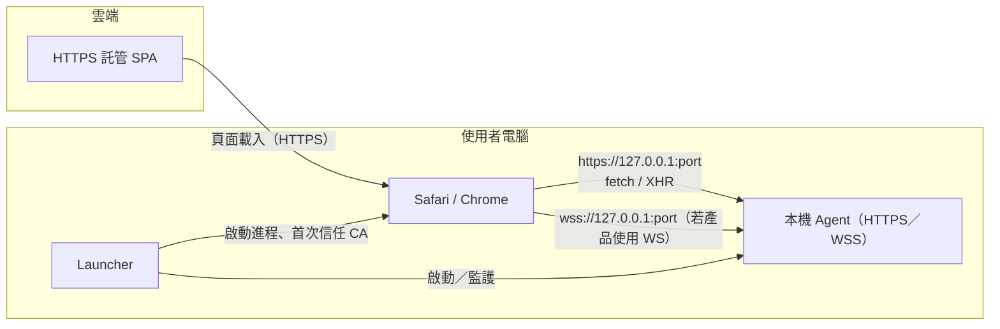
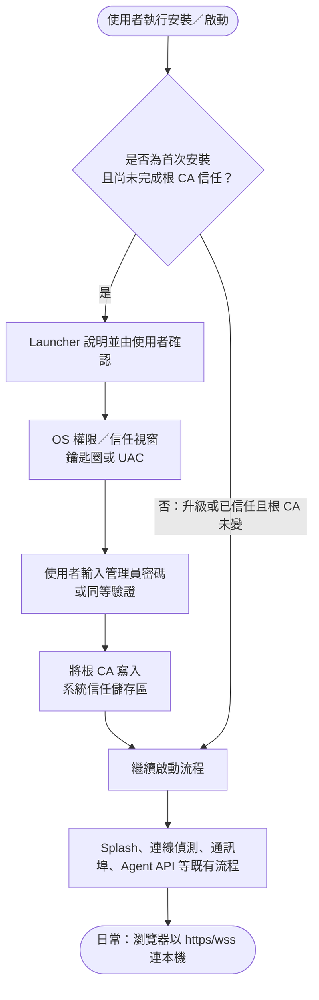
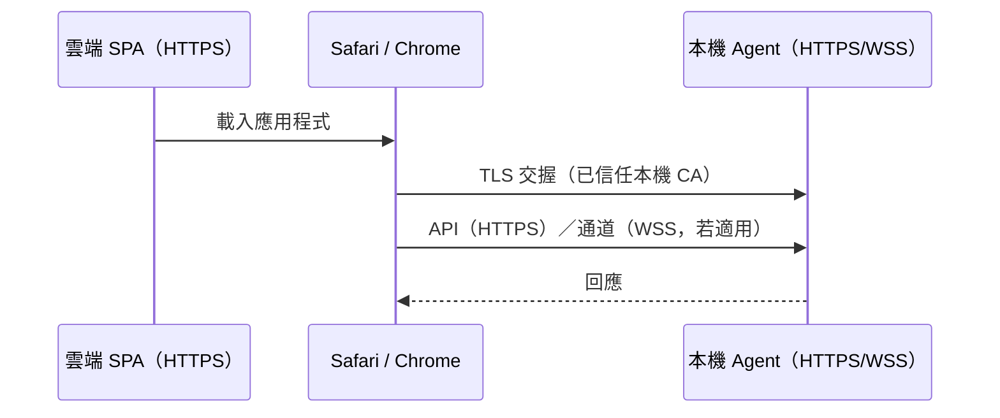

## 背景

雲端託管的 SPA（**HTTPS**）必須與使用者電腦上的 Bundle **本機 agent** 通訊。目前 agent 通常以 **HTTP** 監聽（例如連接埠 5179）。瀏覽器會封鎖**混合內容**（HTTPS 網頁載入 HTTP 子資源）。**Safari** 會直接封鎖，且沒有與 Chrome「Local Network Access」流程可比擬的使用者放行路徑。問題說明（`safari-support/https support issue`）結論是：最直接的做法是在本機 agent 上提供 **HTTPS**（WebSocket 則用 **WSS**）。Agent 以 Python 為基礎；Launcher 可能發行二進位與設定。

## 短期主線（已定調）

與 `proposal.md`「短期主線決策」一致；白話與方案對照見 `safari-support/https-mixed-content-communication-and-trust.md`。

- **本機 agent：** TLS 終止，對外為 **`https://127.0.0.1:<port>`**（及 **`wss://`** 若適用）。
- **雲端 SPA：** 僅以 **`https://`／`wss://`** 指向本機 agent。
- **信任：** **Launcher** 與／或**文件**於**首次安裝**帶使用者完成**一次性**信任（自簽或私有 CA 根）；根 CA **未變**之升級**不重複**；**不**假設公開 CA 可覆蓋 `127.0.0.1`。

**長期：** 後端上雲後改為瀏覽器只打 **雲端 HTTPS API**，與本設計之過渡主線分階段銜接。

## 流程圖

### 端到端資料流（雲端 HTTPS SPA ↔ 本機 agent）

重點：**頁面與呼叫本機的 scheme 均為安全情境**（`https`／`wss`），瀏覽器才不會因**混合內容**攔截；TLS 終止在 **agent**（見 **D1**）。

### Launcher：首次安裝種 CA 與升級（對齊 **D5**／已釐清）

### 瀏覽器側（完成信任後）

## 目標與非目標

**目標：**

- 以 **TLS** 暴露 agent 的 REST（或同等 HTTP）API，使 `https://127.0.0.1:<port>`／`https://localhost:<port>` 在自 HTTPS 來源的網頁中可合法使用。
- 若網頁應用程式使用 WebSocket，則在與 TLS 設定一致的路徑／連接埠上支援 **WSS**，連線不應被歸類為混合內容。
- 界定**本機開發**與**打包安裝**時如何提供或產生 **TLS 憑證**，以及使用者在各平台上至少一次性**信任**憑證的方式。
- 對整合方維持清楚的**基礎 URL 與 scheme 約定**（`https`／`wss`）。
- **雙瀏覽器：** 於**同一組**產品行為下，**Safari** 與 **Google Chrome（Chromium）** 在完成所文件化之信任步驟後，均須能使用本機 **HTTPS**／**WSS** 與 agent 通訊（細部見 `specs/local-agent-https/spec.md`）。
- **非迴歸：** 導入 TLS／HTTPS **不得**無說明地破壞既有流程；至少涵蓋 **splash**、**連線偵測**、**連接埠**啟動與監聽、與 agent 之 **API** 溝通等（見同規格）。

**非目標：**

- 為規避混合內容而改為僅以 HTTP 託管雲端（在主要託管商實務上不可行）。
- 為 `localhost`／`127.0.0.1` 使用正式環境 PKI 或公開 CA 簽發之「全域預設信任」憑證作為**預設**（公開 CA 常規無法覆蓋；除非日後產品另有需求，否則不在範圍內）。
- 雲端中繼／Proxy 架構作為預設產品架構（問題文件與 `safari-support` 列為已評估但未選定之路線）。
- 僅以 Electron 或瀏覽器擴充功能繞過作為唯一解法。

## 設計決策

### D1：TLS 終止於本機 agent（非僅依賴外部反向代理）

**選擇：** 在 agent 進程內（或由 Launcher 緊密管理的 sidecar）實作 TLS，監聽與今日相同的邏輯服務。

**理由：** 終端使用者額外元件最少；符合問題文件與 **短期主線決策**（流量、合規、穩定度見 `safari-support/https-mixed-content-communication-and-trust.md`）。

**曾考量替代方案：** 本機 Nginx／Caddy（需額外安裝）；雲端 Proxy／中繼（運維、隱私與**醫療／牙科資料**法遵成本較高，非主線）。

### D2：開發／本機等級信任模型（自簽或私有 CA）

**選擇：** 使用**自簽伺服器憑證**及／或依各平台規範之**本機 CA** 根憑證；於每台機器**首次安裝時一次性**安裝／信任（升級不重複，見 **D5**）。

**理由：** 公開 CA 不會為任意 `127.0.0.1` 發證；本機信任是開發／本機工具的常見模式。

**曾考量替代方案：** 在 Launcher 內做類似 `mkcert` 的自動化；純瀏覽器例外流程（在 Safari 上不穩定）。

### D3：WebSocket 在啟用 TLS 時與 HTTPS 共用相同 TLS 情境

**選擇：** 啟用 TLS 後，任何對網頁 UI 暴露的 `ws://` 端點改為 `wss://`，共用憑證材料，並在適用時使用相同監聽連接埠或文件化的對應關係。

**理由：** 混合內容規則對 WebSocket 與對 HTTP 請求同等適用。

### D4：直接採 HTTPS/WSS-only（不保留 HTTP 雙堆疊）

**選擇：** 開發（程式碼直接運行）與打包（packaged）兩種模式皆採 **HTTPS**（及若適用之 **WSS**）為唯一支援路徑；不提供 HTTP 例外旗標或雙監聽。

**理由：** 與 HTTPS 頁面的安全情境完全一致，避免整合方因遷移期路徑造成 scheme 混淆與不一致行為。

**曾考量替代方案：** 保留開發用 HTTP＋HTTPS 雙監聽（遷移阻力較低，但容易持續產生錯誤示範與相容性落差）。

### D6：後端執行型態一致性（dev/runtime 與 packaged）

**選擇：** 後端專案在「程式碼直接運行（dev/runtime）」與「打包後運行（packaged）」兩種執行型態，需共用一致的 TLS 憑證策略與 URL 約定，且皆可與 HTTPS 前端正常通訊。

**理由：** 降低「開發可通、打包不通」或「打包可通、開發不通」的環境落差，避免發版前後行為不一致。

**曾考量替代方案：** 僅規範 packaged 模式；但此作法會把問題延後到整合與發版階段，除錯成本高。

### D5：內嵌靜態憑證與單次 CA 信任

**選擇：**

- **憑證材料：** **單一組** TLS／CA 材料**內嵌於後端（agent）／安裝包**，所有使用者安裝後為**同一組**；**預期長期沿用**，**除非**有必要（例如安全事件、合規、密碼學升級、金鑰汰換），**否則不**為例行輪替而更新。必要時隨產品版本與 release note 一併更換材料。
- **本機 CA 信任：** **僅第一次安裝**執行「引導式升權後寫入 CA」（見 **已釐清**）。**後續升級至新版**時，**不**再次要求管理員密碼、**不**再次自動安裝 CA——**前提**為發行版仍使用**同一**受信任根 CA；若日後發布**更換根 CA**之版本，再於文件與公告中定義是否觸發**一次性**重新信任。

**理由：** 降低升級摩擦與支援成本；與「全用戶共用同一內嵌材料」之前提一致。

**曾考量替代方案：** **每裝／每台產生**（每台密鑰不同，升級與支援路徑較複雜）。

## 風險與權衡

| 風險 | 緩解 |
|------|------|
| 使用者不理解憑證警告 | 文件化一次性信任流程；Launcher 可在允許時開啟系統信任說明或安裝本機 CA。 |
| Safari 與 Chrome 信任體驗不同 | 於 Safari 實測；將排解撰寫於 runbook，與 CORS／混合內容分開說明。 |
| 多個版本庫寫死 `http://` | 集中 agent 基礎 URL 設定；於 release note 標明破壞性變更。 |
| 全體安裝共用同一組內嵌金鑰 | 文件與資安納入威脅模型；僅於必要時換鑰並搭配明確升級與重新信任說明。 |
| 本機 TLS 效能開銷 | 一般 agent 流量下可忽略；若有熱路徑再 profiling。 |

## 遷移計畫

1. 發布具 TLS 能力的 agent 與憑證策略；預計與 HTTPS SPA 搭配的**打包建置**預設採 **HTTPS**。
2. 將網頁用戶端的文件化環境／設定更新為 `https://`／`wss://`。
3. 對面向雲端的整合**棄用**純 `http://`／`ws://`；開發與打包模式皆採 `https://`／`wss://`。
4. **回滾：** 還原至先前 agent 建置與 HTTP URL（須知在修復 HTTPS 路徑前，Safari＋HTTPS 網頁將持續失敗）。

## 已釐清

- **非瀏覽器用戶端與並行 HTTP：** 目前**沒有**非瀏覽器用戶端必須長期依賴純 HTTP、因而需無限期保留「未加密監聽與 HTTPS 並行」的需求。後續若出現此類整合，再另開變更評估。
- **分發方式：** Launcher／agent **不**依賴 Mac App Store、Microsoft Store 等應用程式商店通路；產品以**完成程式碼簽章（數位簽章）**之安裝套件或二進位**提供使用者下載並安裝**。因此本 change **不**將「商店審核／商店政策」視為 Trust UI 或是否種植本機 CA 的**主要**決策約束；若日後另走上架商店，再單獨評估。實務上仍須面對各 OS 的**管理員權限**、使用者同意、企業環境安全軟體等非商店因素。
- **本機 CA 信任（所謂「自動」）流程已定調：** **Launcher 說明並由使用者確認** → **OS 權限／信任視窗**（鑰匙圈、UAC 等）→ **使用者輸入管理員密碼**（或同等驗證）**並同意** → **代為將 CA 寫入** macOS 鑰匙圈或 Windows 受信任根憑證儲存區。此為**引導式升權後寫入**，**非**無聲背景寫入。
- **憑證材料策略（已定調）：** **單一組**內嵌於安裝包，**全使用者相同**，**預期長期使用**；**除非**有必要，**不**特別為輪替而更新。細部見 **D5**。
- **CA 信任觸發頻率（已定調）：** **僅首次安裝**須完成上述升權寫入 CA；**後續安裝新版**在根 CA **未變**之前提下**不**再要求密碼、**不**再自動安裝 CA。更換根 CA 時另案處理（見 **D5**）。
- **手動備援：** **不**提供。使用者僅透過上文「引導式升權後寫入 CA」完成信任；若日後產品要求額外途徑再另開變更。
- **例外場景：** 無管理員權限、kiosk、受管理企業裝置等**本 change 不**定義專用行為或支援路徑；有需要時再單獨補規格。

## 附註：何謂「介面與文件用字」

先前所謂**介面與文件用字**，不是要你現在就多一組抽象「規格」，而是指**使用者實際看到、讀到的文字**，例如：

- Launcher **視窗標題**、說明段落、**按鈕標籤**（例如是否寫「繼續」「安裝憑證」）。
- 成功、失敗或**權限被拒**時的**提示訊息**。
- 給終端使用者或 IT 的**說明文件／release note**裡，步驟怎麼描述、資安注意事項寫到哪個粒度。

**本設計檔只定流程與決策**（要做什麼、為何需要密碼、會把 CA 放進哪裡）；**上述逐句中文（或英文）**留給實作、UX 與技術文件在開發與發版前定稿即可，無須在 `design.md` 再列「待決用字」。
